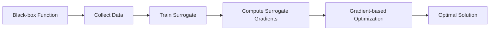

# surrogate-gradient-optim-lab

[](https://github.com/your-org/surrogate-gradient-optim-lab/actions)
[](LICENSE)
[](https://www.python.org/downloads/)
[](https://github.com/google/jax)

Toolkit for offline black-box optimization using learned gradient surrogates. When you can't compute real gradients (simulators, hardware, human feedback), learn approximations that enable gradient-based optimization.

## 🎯 Key Features

- **Gradient-Free → Gradient-Based**: Convert any black-box function to differentiable
- **Multiple Surrogate Types**: Neural networks, Gaussian processes, random forests
- **Offline Optimization**: Works with pre-collected data, no online queries needed
- **JAX-Powered**: Fast, functional, and fully differentiable
- **Visual Diagnostics**: Compare true vs surrogate gradients interactively
- **Benchmark Suite**: Standard test functions and real-world problems

## 📋 Table of Contents

- [Installation](#installation)
- [Quick Start](#quick-start)
- [Core Concepts](#core-concepts)
- [Surrogate Models](#surrogate-models)
- [Training Surrogates](#training-surrogates)
- [Optimization](#optimization)
- [Visualization](#visualization)
- [Benchmarks](#benchmarks)
- [Real-World Examples](#real-world-examples)
- [API Reference](#api-reference)
- [Contributing](#contributing)

## 🚀 Installation

### From PyPI

```bash
pip install surrogate-gradient-optim-lab
```

### From Source with CUDA

```bash
git clone https://github.com/your-org/surrogate-gradient-optim-lab
cd surrogate-gradient-optim-lab

# Install with GPU support
pip install -e ".[cuda]"
```

### Docker Installation

```bash
docker pull your-org/surrogate-optim:latest
docker run -it --gpus all your-org/surrogate-optim:latest
```

## ⚡ Quick Start

### Basic Example

```python
from surrogate_optim import SurrogateOptimizer, collect_data
import jax.numpy as jnp

# Define your black-box function
def black_box_function(x):
    # Could be a simulator, hardware measurement, etc.
    return -jnp.sum(x**2) + jnp.sin(5 * jnp.linalg.norm(x))

# Collect some data
data = collect_data(
    function=black_box_function,
    n_samples=1000,
    bounds=[(-5, 5), (-5, 5)],
    sampling="sobol"  # or "random", "grid", "latin_hypercube"
)

# Train surrogate model
optimizer = SurrogateOptimizer(
    surrogate_type="neural_network",
    hidden_dims=[64, 64],
    activation="relu"
)

surrogate = optimizer.fit_surrogate(data)

# Now optimize using learned gradients!
x_opt = optimizer.optimize(
    initial_point=jnp.array([2.0, 2.0]),
    method="L-BFGS-B",
    num_steps=100
)

print(f"Optimum found at: {x_opt}")
print(f"Function value: {black_box_function(x_opt):.4f}")
```

### Quick Benchmark

```python
from surrogate_optim import benchmark_surrogate

# Test on standard functions
results = benchmark_surrogate(
    surrogate_model=surrogate,
    test_functions=["rosenbrock", "rastrigin", "ackley"],
    dimensions=[2, 10, 50],
    n_trials=20
)

print(f"Average optimality gap: {results.mean_gap:.2%}")
print(f"Gradient approximation error: {results.grad_error:.4f}")
```

## 🧠 Core Concepts

### What are Surrogate Gradients?

```python
from surrogate_optim import visualize_concept

# Visualize the idea
visualize_concept.show_surrogate_gradients(
    true_function=lambda x: x**3 - 3*x,
    surrogate_function=learned_surrogate,
    x_range=(-2, 2)
)
```

When you have:
- ❌ No access to gradients (black-box function)
- ❌ Expensive function evaluations
- ✅ Some offline data

Solution: Learn a differentiable surrogate that approximates the true function!

### The Surrogate Optimization Loop



## 🔧 Surrogate Models

### Neural Network Surrogates

```python
from surrogate_optim.models import NeuralSurrogate

# Flexible neural network surrogate
nn_surrogate = NeuralSurrogate(
    layers=[128, 128, 64],
    activation="gelu",
    dropout_rate=0.1,
    ensemble_size=5  # Uncertainty estimation
)

# Train with gradient matching loss
nn_surrogate.fit(
    X_train, y_train,
    gradient_data=gradient_samples,  # If available
    loss_weights={"value": 1.0, "gradient": 0.5}
)

# Get predictions with uncertainty
mean, std = nn_surrogate.predict_with_uncertainty(X_test)
```

### Gaussian Process Surrogates

```python
from surrogate_optim.models import GPSurrogate

# GP with automatic kernel selection
gp_surrogate = GPSurrogate(
    kernel="auto",  # Automatically selects best kernel
    noise_level=0.1,
    normalize_y=True
)

# Fit and get posterior
gp_surrogate.fit(X_train, y_train)

# Analytical gradients from GP
gradients = gp_surrogate.gradient(X_test)
```

### Random Forest Surrogates

```python
from surrogate_optim.models import RandomForestSurrogate

# Differentiable random forest
rf_surrogate = RandomForestSurrogate(
    n_estimators=100,
    max_depth=10,
    smooth_predictions=True  # Enable gradient computation
)

rf_surrogate.fit(X_train, y_train)

# Approximate gradients via smoothing
grads = rf_surrogate.smooth_gradient(X_test, bandwidth=0.1)
```

### Hybrid Models

```python
from surrogate_optim.models import HybridSurrogate

# Combine multiple surrogate types
hybrid = HybridSurrogate(
    models=[
        ("nn", NeuralSurrogate(layers=[64, 64])),
        ("gp", GPSurrogate(kernel="rbf")),
        ("rf", RandomForestSurrogate(n_estimators=50))
    ],
    aggregation="weighted_average",  # or "stacking", "voting"
    weight_optimization="cv"  # Cross-validation for weights
)

hybrid.fit(X_train, y_train)
```

## 🎓 Training Surrogates

### Data Collection Strategies

```python
from surrogate_optim.data import DataCollector

collector = DataCollector(black_box_function)

# Active learning for efficient data collection
data = collector.collect_adaptive(
    initial_samples=100,
    acquisition_function="expected_improvement",
    batch_size=10,
    n_iterations=20,
    bounds=[(-10, 10)] * dim
)

# Augment with gradient information (if available)
data_with_grads = collector.estimate_gradients(
    data,
    method="finite_differences",
    epsilon=1e-3
)
```

### Training with Multiple Objectives

```python
from surrogate_optim.training import MultiObjectiveTrainer

# Train to match function values AND gradients
trainer = MultiObjectiveTrainer(
    objectives={
        "function_value": {"weight": 1.0, "loss": "mse"},
        "gradient_alignment": {"weight": 0.5, "loss": "cosine"},
        "smoothness": {"weight": 0.1, "loss": "l2_regularization"}
    }
)

trained_surrogate = trainer.train(
    model=nn_surrogate,
    data=training_data,
    validation_split=0.2,
    epochs=1000,
    early_stopping=True
)
```

### Curriculum Learning

```python
from surrogate_optim.training import CurriculumTrainer

# Start with easy regions, expand to harder ones
curriculum = CurriculumTrainer(
    difficulty_metric="gradient_magnitude",
    stages=[
        {"difficulty": "easy", "epochs": 100},
        {"difficulty": "medium", "epochs": 200},
        {"difficulty": "hard", "epochs": 300}
    ]
)

surrogate = curriculum.train_progressive(model, data)
```

## 🚀 Optimization

### Gradient-Based Optimization

```python
from surrogate_optim import optimize_with_surrogate
import jax

# Define optimization problem
def optimize_surrogate(surrogate, x0, constraints=None):
    # Get gradients from surrogate
    grad_fn = jax.grad(surrogate.predict)
    
    # Use any gradient-based optimizer
    from jax.scipy.optimize import minimize
    result = minimize(
        fun=lambda x: -surrogate.predict(x),  # Minimize negative for maximization
        x0=x0,
        method='BFGS',
        jac=lambda x: -grad_fn(x)
    )
    
    return result.x

# Run optimization
x_optimal = optimize_surrogate(
    trained_surrogate,
    x0=jnp.array([1.0, 1.0]),
    constraints={"bounds": [(-5, 5), (-5, 5)]}
)
```

### Trust Region Methods

```python
from surrogate_optim.optimizers import TrustRegionOptimizer

# Optimization with trust regions for reliability
tr_optimizer = TrustRegionOptimizer(
    surrogate=trained_surrogate,
    true_function=black_box_function,  # For validation
    initial_radius=0.5,
    max_radius=2.0,
    eta=0.15  # Acceptance threshold
)

# Optimize with periodic validation
trajectory = tr_optimizer.optimize(
    x0=initial_point,
    max_iterations=50,
    validate_every=5  # Check against true function
)

# Analyze optimization path
tr_optimizer.plot_trajectory(trajectory)
```

### Multi-Start Optimization

```python
from surrogate_optim.optimizers import MultiStartOptimizer

# Global optimization via multi-start
ms_optimizer = MultiStartOptimizer(
    surrogate=trained_surrogate,
    n_starts=20,
    start_method="sobol",  # or "random", "grid"
    local_optimizer="L-BFGS-B"
)

# Find global optimum
global_results = ms_optimizer.optimize_global(
    bounds=[(-10, 10)] * dim,
    parallel=True
)

best_x = global_results.best_point
best_value = global_results.best_value
```

## 📊 Visualization

### Gradient Field Comparison

```python
from surrogate_optim.visualization import GradientVisualizer

viz = GradientVisualizer()

# Compare true vs surrogate gradients
viz.plot_gradient_fields(
    true_function=black_box_function,
    surrogate=trained_surrogate,
    bounds=[(-5, 5), (-5, 5)],
    resolution=50,
    save_to="gradient_comparison.png"
)

# 3D surface with gradient vectors
viz.plot_3d_surface_with_gradients(
    function=trained_surrogate.predict,
    gradient_fn=trained_surrogate.gradient,
    bounds=[(-3, 3), (-3, 3)],
    interactive=True
)
```

### Optimization Landscape

```python
from surrogate_optim.visualization import LandscapeVisualizer

landscape_viz = LandscapeVisualizer()

# Visualize optimization landscape
landscape_viz.plot_optimization_landscape(
    surrogate=trained_surrogate,
    true_function=black_box_function,
    optimization_paths=trajectory,
    contour_levels=20,
    show_minima=True
)

# Error heatmap
landscape_viz.plot_approximation_error(
    surrogate=trained_surrogate,
    true_function=black_box_function,
    bounds=[(-5, 5), (-5, 5)],
    metric="relative_error"
)
```

### Interactive Dashboard

```python
from surrogate_optim.dashboard import SurrogateDashboard

# Launch interactive dashboard
dashboard = SurrogateDashboard(
    surrogate=trained_surrogate,
    true_function=black_box_function,
    data=training_data
)

dashboard.add_panel("gradient_comparison")
dashboard.add_panel("optimization_progress")
dashboard.add_panel("uncertainty_map")
dashboard.add_panel("performance_metrics")

dashboard.launch(port=8080)
# Access at http://localhost:8080
```

## 📈 Benchmarks

### Standard Test Functions

```python
from surrogate_optim.benchmarks import BenchmarkSuite

suite = BenchmarkSuite()

# Test on classic optimization problems
results = suite.evaluate_surrogate(
    surrogate_model=trained_surrogate,
    test_functions=[
        "rosenbrock",
        "rastrigin", 
        "ackley",
        "griewank",
        "schwefel",
        "levy"
    ],
    dimensions=[2, 5, 10, 20],
    metrics=["optimality_gap", "gradient_error", "convergence_rate"]
)

# Generate benchmark report
suite.create_report(results, "benchmark_report.html")
```

### Real-World Benchmarks

```python
from surrogate_optim.benchmarks import RealWorldBenchmarks

rw_bench = RealWorldBenchmarks()

# Engineering design problems
results = rw_bench.run_benchmarks([
    "pressure_vessel_design",
    "welded_beam_design",
    "spring_design",
    "gear_train_design"
])

# Compare against other methods
rw_bench.compare_methods({
    "surrogate_gradient": trained_surrogate,
    "bayesian_opt": bayesian_baseline,
    "random_search": random_baseline,
    "cma_es": cmaes_baseline
})
```

## 💡 Real-World Examples

### Hyperparameter Tuning

```python
from surrogate_optim.applications import HyperparameterTuner

# When training is expensive
def expensive_ml_training(hyperparams):
    # Simulate expensive model training
    model = train_model(hyperparams)
    return model.validation_score()

# Create surrogate for hyperparameter landscape
tuner = HyperparameterTuner(
    objective_function=expensive_ml_training,
    param_space={
        "learning_rate": (1e-5, 1e-1, "log"),
        "batch_size": (16, 256, "int"),
        "dropout": (0.0, 0.5, "float"),
        "hidden_units": (32, 512, "int")
    }
)

# Collect initial data
tuner.explore(n_random=50)

# Train surrogate and optimize
best_params = tuner.optimize_with_surrogate(
    n_iterations=20,
    acquisition="expected_improvement"
)
```

### Robot Control

```python
from surrogate_optim.applications import RobotControlOptimizer

# Optimize robot controller parameters
def robot_performance(control_params):
    # Expensive simulation or real robot test
    return simulate_robot(control_params).score

controller_opt = RobotControlOptimizer(
    performance_fn=robot_performance,
    param_bounds={
        "kp": (0.1, 10.0),
        "ki": (0.01, 1.0),
        "kd": (0.01, 5.0)
    }
)

# Learn from past experiments
controller_opt.learn_from_history("robot_experiments.csv")

# Optimize control parameters
optimal_params = controller_opt.find_optimal_control()
```

### Chemical Reaction Optimization

```python
from surrogate_optim.applications import ReactionOptimizer

# Optimize reaction conditions
def reaction_yield(conditions):
    # Expensive lab experiment or simulation
    return run_reaction(**conditions)

reaction_opt = ReactionOptimizer(
    yield_function=reaction_yield,
    variables={
        "temperature": (20, 100),  # Celsius
        "pressure": (1, 10),       # atm
        "catalyst_amount": (0.1, 5.0),  # grams
        "reaction_time": (0.5, 24)  # hours
    }
)

# Use existing experimental data
reaction_opt.load_experimental_data("experiments.csv")

# Optimize with safety constraints
optimal_conditions = reaction_opt.optimize(
    constraints=[
        "temperature < 80",  # Safety limit
        "pressure < 5"       # Equipment limit
    ]
)
```

## 📚 API Reference

### Core Classes

```python
class SurrogateOptimizer:
    def fit_surrogate(self, data: Dataset) -> Surrogate
    def optimize(self, initial_point: Array) -> Array
    def validate(self, test_function: Callable) -> ValidationResult

class Surrogate(ABC):
    @abstractmethod
    def predict(self, x: Array) -> float
    
    @abstractmethod
    def gradient(self, x: Array) -> Array
    
    def uncertainty(self, x: Array) -> float

class DataCollector:
    def collect_uniform(self, n_samples: int) -> Dataset
    def collect_adaptive(self, acquisition_fn: str) -> Dataset
```

### Optimization Methods

```python
def optimize_with_surrogate(
    surrogate: Surrogate,
    x0: Array,
    method: str = "L-BFGS-B",
    options: Dict = None
) -> OptimizationResult

def multi_start_optimize(
    surrogate: Surrogate,
    bounds: List[Tuple],
    n_starts: int = 10
) -> GlobalOptimizationResult
```

## 🤝 Contributing

We welcome contributions! Priority areas:
- New surrogate model types
- Advanced optimization algorithms
- Real-world application examples
- Performance optimizations

See [CONTRIBUTING.md](CONTRIBUTING.md) for guidelines.

### Development Setup

```bash
# Clone repository
git clone https://github.com/your-org/surrogate-gradient-optim-lab
cd surrogate-gradient-optim-lab

# Install dev dependencies
pip install -e ".[dev]"

# Run tests
pytest tests/

# Run benchmarks
python benchmarks/run_all_benchmarks.py
```

## 📄 License

This project is licensed under the Apache License 2.0 - see the [LICENSE](LICENSE) file for details.

## 🔗 Related Projects

- [JAX](https://github.com/google/jax) - Composable transformations
- [Optax](https://github.com/deepmind/optax) - Gradient processing
- [GPyTorch](https://github.com/cornellius-gp/gpytorch) - Gaussian processes
- [Ax](https://github.com/facebook/Ax) - Adaptive experimentation

## 📞 Support

- 📧 Email: surrogate-optim@your-org.com
- 💬 Discord: [Join our community](https://discord.gg/your-org)
- 📖 Documentation: [Full docs](https://docs.your-org.com/surrogate-optim)
- 🎓 Tutorial: [Surrogate Optimization](https://learn.your-org.com/surrogate)

## 📚 References

- [Learning Surrogates for Offline Black-Box Optimization](https://arxiv.org/abs/2503.01883) - Main paper
- [Gradient-Based Optimization of Black-Box Functions](https://arxiv.org/abs/2012.13349) - Related work
- [Neural Network Surrogates](https://arxiv.org/abs/1909.08593) - NN approximation
- [Bayesian Optimization](https://arxiv.org/abs/1807.02811) - Background
